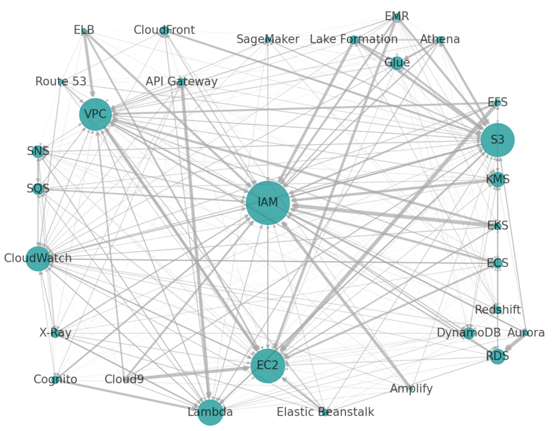
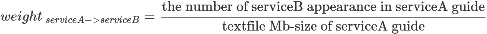
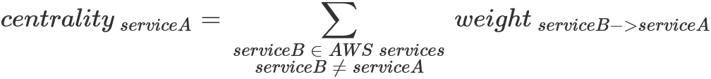

## AWS Service Co-Occurrence Analytics
This repository is my personal Jupyter Notebook project for AWS Service Co-Occurrence Analytics. As you know, AWS offers lots of services such as EC2, S3, RDS, and more; furthermore, those services are related and cooperate with each other. This project tried to find out the relationships among AWS services, using AWS official guides (PDF files) and simple indicators. The following network diagram is one of that measurement results and shows strong/weak relationships among AWS services. For more details, please see the next section. 

#### [AWS Service Co-Occurrence Network]

## How to Measure Relationships among AWS Services
To measure relationships among AWS services uses AWS official PDF guide that you can download from the document site (https://docs.aws.amazon.com/index.html). The measurement method is straightforward, which is just counting the appearance of the service name in a guide. We determine the strength of relationships by how many times service name S3 appears in EC2 guide. If service name S3 appears many times in EC2 guide, then we can infer a strong relationship from EC2 to S3. Vice versa, we bidirectionally count the appearance of service name EC2 in S3 guide. Moreover we apply that counting method to many AWS services (in this measurement, I selected 30 services, see the next section.) Of course, the length of guides impacts on the appearance of the service name; therefore, we need to standardize by the length of guides. Let us call the strength of relationship **weight**. Please see the following "weight" definitions.

Once we define the weight of relationships among services, we can measure which services are strongly referred to, which means those services play essential roles in some sense. Definitely, definitely, each AWS service plays a uniquely important role, but in this project, we measure the **centrality** of service as an indicator of how strongly used from other services. Please see the following "centrality" definitions. 

Regarding the detailed process of calculating the weight and centrality, please see AWSServiceCoOccurrenceAnalytics notebook.

### Definitions in This Measurement

#### weight of relationship:

the degree of strength of relationship between 2 services:

#### centrality:

the magnitude of usage role of a service:

## List of Input AWS Guide

Here is an AWS guide list of 30 services that I used in this measurement. Measurement result highly depends on what services we select. The measurement result will also change if we select other services except for the following list. In other words, you can re-measure the weight and centrality, using other arbitrary guide lists and this notebook.

measurement period: around the year-end of 2021

| # |Category  |Service  |Guide (PDF file)  |
|---|---|---|---|
| 1|**Compute**  |EC2  |[User Guide for Linux Instances](https://docs.aws.amazon.com/AWSEC2/latest/UserGuide/concepts.html)  |
| 2|  |Lambda  |[Developer Guide](https://docs.aws.amazon.com/lambda/latest/dg/index.html)  |
| 3|  |Elastic Beanstalk  |[Developer Guide](https://docs.aws.amazon.com/elasticbeanstalk/latest/dg/index.html)   |
| 4|**Containers**  |ECS  |[Developer Guide](https://docs.aws.amazon.com/AmazonECS/latest/developerguide/index.html)   |
| 5|  |EKS  |[User Guide](https://docs.aws.amazon.com/eks/latest/userguide/index.html)   |
| 6|**Storage**  |S3  |[User Guide](https://docs.aws.amazon.com/AmazonS3/latest/userguide/index.html)   |
| 7|  |EFS  |[User Guide](https://docs.aws.amazon.com/efs/latest/ug/index.html)   |
| 8|**Database**  |Aurora  |[Amazon Aurora User Guide](https://docs.aws.amazon.com/AmazonRDS/latest/AuroraUserGuide/index.html)   |
| 9|  |DynamoDB  |[Developer Guide](https://docs.aws.amazon.com/amazondynamodb/latest/developerguide/index.html)   |
|10|  |RDS  |[Amazon RDS User Guide](https://docs.aws.amazon.com/AmazonRDS/latest/UserGuide/index.html)   |
|11|  |Redshift  |[Redshift Database Developer Guide](https://docs.aws.amazon.com/redshift/latest/dg/index.html)   |
|12|**Security, Identity, & Compliance**  |IAM  |[IAM User Guide](https://docs.aws.amazon.com/IAM/latest/UserGuide/index.html)   |
|13|  |Cognito |[Developer Guide](https://docs.aws.amazon.com/cognito/latest/developerguide/what-is-amazon-cognito.html)   |
|14|**Cryptography & PKI**  |KMS  |[Developer Guide](https://docs.aws.amazon.com/kms/latest/developerguide/index.html)   |
|15|**Machine Learning**  |SageMaker  |[Developer Guide](https://docs.aws.amazon.com/sagemaker/latest/dg/whatis.html) |
|16|**Management & Governance**  |CloudWatch  |[CloudWatch User Guide](https://docs.aws.amazon.com/AmazonCloudWatch/latest/monitoring/index.html)   |
|17|**Developer Tools**  |Cloud9  |[User Guide](https://docs.aws.amazon.com/cloud9/latest/user-guide/index.html)   |
|18|  |X-Ray  |[Developer Guide](https://docs.aws.amazon.com/xray/latest/devguide/aws-xray.html)   |
|19|**Networking & Content Delivery**  |API Gateway  |[Developer Guide](https://docs.aws.amazon.com/apigateway/latest/developerguide/index.html)   |
|20|  |CloudFront  |[Developer Guide](https://docs.aws.amazon.com/AmazonCloudFront/latest/DeveloperGuide/index.html)   |
|21|  |ELB  |[User Guide](https://docs.aws.amazon.com/elasticloadbalancing/latest/userguide/index.html)   |
|22|  |Route 53  |[Developer Guide](https://docs.aws.amazon.com/Route53/latest/DeveloperGuide/index.html)   |
|23|  |VPC  |[User Guide](https://docs.aws.amazon.com/vpc/latest/userguide/index.html)   |
|24|**Front-End Web & Mobile**  |Amplify  |[User Guide](https://docs.aws.amazon.com/amplify/latest/userguide/index.html)   |
|25|**Analytics**  |Athena  |[User Guide](https://docs.aws.amazon.com/athena/latest/ug/what-is.html)   |
|26|  |EMR  |[Management Guide](https://docs.aws.amazon.com/emr/latest/ManagementGuide/index.html)   |
|27|  |Glue  |[Developer Guide](https://docs.aws.amazon.com/glue/latest/dg/what-is-glue.html)   |
|28|  |Lake Formation  |[Developer Guide](https://docs.aws.amazon.com/lake-formation/latest/dg/what-is-lake-formation.html)   |
|29|**Application Integration**  |SNS  |[Developer Guide](https://docs.aws.amazon.com/sns/latest/dg/index.html)   |
|30|  |SQS  |[Developer Guide](https://docs.aws.amazon.com/AWSSimpleQueueService/latest/SQSDeveloperGuide/welcome.html)   |

